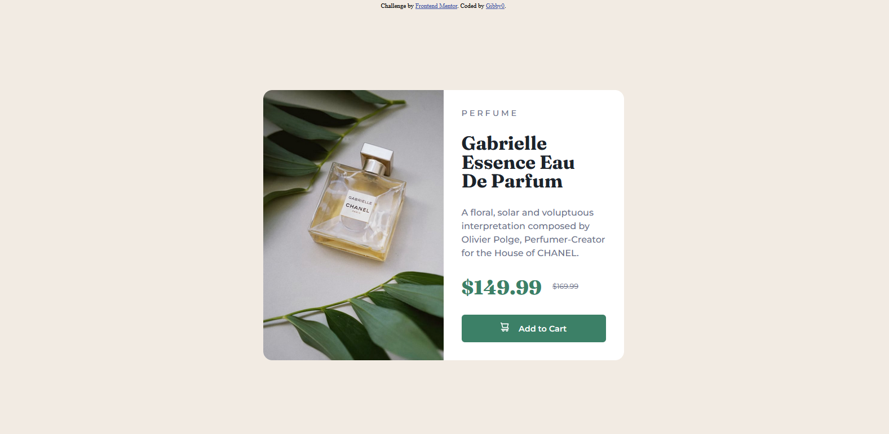

# Frontend Mentor - Product preview card component solution

This is a solution to the [Product preview card component challenge on Frontend Mentor](https://www.frontendmentor.io/challenges/product-preview-card-component-GO7UmttRfa). Frontend Mentor challenges help you improve your coding skills by building realistic projects. 

## Table of contents

- [Overview](#overview)
  - [Screenshot](#screenshot)
  - [Links](#links)
  - [Built with](#built-with)
  - [Continued development](#continued-development)
  - [Author](#author)

## Overview
This project is a solution to the Product preview card component challenge on Frontend Mentor.

### Screenshot

### Links

- Solution URL: (https://www.frontendmentor.io/solutions/social-links-profile-solution-using-html-and-css-_-rc4KwklH)
- Live Site URL: (https://gibby0.github.io/Frontend-Mentor-Social-links-profile-solution-html-and-css/product.html)

### Built with

- Semantic HTML5 markup
- CSS custom properties
-Flexbox
-Google Fonts - specifically the Fraunces & Montserrat, enhancing the stylistic delivery of the component.

### Continued development

I plan to continue learning more about Flexbox in order to fully utilize it within my projects.

## Author
- Website - Github(https://github.com/Gibby0)
- Frontend Mentor - [@Gibby0](https://www.frontendmentor.io/profile/Gibby0)
